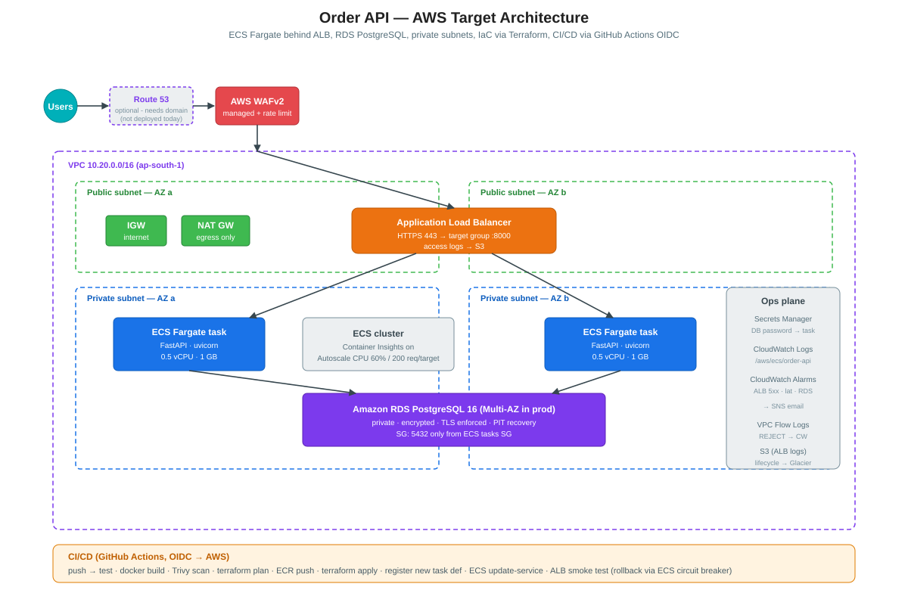

# AWS Cloud Engineer Assessment — Order Management Platform

**A production-shaped, containerized order-management API on AWS**, built as a migration target from a legacy API Gateway + Lambda + RDS stack.

- **App:** FastAPI (Python 3.12) + PostgreSQL, containerized, idempotent writes.
- **Infra:** Terraform. ECS Fargate behind ALB + WAF, RDS Postgres in private subnets, Secrets Manager, S3, CloudWatch, VPC Flow Logs.
- **Delivery:** GitHub Actions → OIDC → AWS. No long-lived keys anywhere.
- **Docs:** every design decision documented; migration, incident-response, security, scalability, cost.



## Table of contents
1. [Repo layout](#repo-layout)
2. [Local run](#local-run)
3. [Tests](#tests)
4. [Deploy to AWS](#deploy-to-aws)
5. [How CI/CD works](#how-cicd-works)
6. [What each doc covers](#what-each-doc-covers)
7. [Design decisions (short form)](#design-decisions-short-form)
8. [Assessment §15 — final engineering questions](#assessment-15--final-engineering-questions)
9. [Assumptions and limitations](#assumptions-and-limitations)
10. [Cleanup](#cleanup)

---

## Repo layout

```
.
├── app/                    FastAPI application + tests
│   ├── main.py             endpoints, middleware, error handling
│   ├── models.py           SQLAlchemy Order model with idempotency_key UNIQUE
│   ├── schemas.py          Pydantic validation
│   ├── database.py         engine + bounded pool + pool_pre_ping
│   ├── config.py           12-factor env config
│   ├── logging_config.py   JSON logs for CloudWatch Logs Insights
│   └── tests/              pytest, SQLite in-memory (CI needs no Postgres)
├── docker/
│   ├── Dockerfile          multi-stage, non-root, HEALTHCHECK
│   └── docker-compose.yml  postgres + api for local dev
├── docker-compose.yml      thin root wrapper
├── terraform/
│   ├── backend/            bootstrap: S3 state bucket + DDB lock table
│   ├── environments/dev/   composes all modules
│   └── modules/            vpc, alb, ecs, rds, secrets, ecr, s3, waf,
│                           iam-github-oidc, monitoring
├── .github/workflows/
│   ├── ci.yml              tests, docker build, Trivy scan, tf plan
│   └── deploy.yml          build + push image, tf apply, ECS update, smoke test
├── architecture/
│   ├── ARCHITECTURE.md     design decisions
│   └── architecture-diagram.svg
├── scripts/                bootstrap / deploy / destroy helpers
├── Makefile                shortcuts
├── MIGRATION.md            traffic-shift plan
├── MIGRATION_INCIDENT.md   answers to the 75/25 incident scenario
├── INCIDENT_RESPONSE.md    troubleshooting HTTP 503 after a deploy
├── SECURITY.md             defence in depth
├── SCALABILITY.md          5k → 50k concurrent users
├── COST_OPTIMIZATION.md    cost levers, ordered by impact
└── docs/INTERVIEW_PREP.md  speaker-notes: how to defend every decision
```

---

## Local run

Requires Docker + Docker Compose v2.

```bash
cp .env.example .env
# edit DB_PASSWORD

docker compose up --build
```

Then, in another shell:

```bash
# health
curl -sS http://localhost:8000/health | jq

# create an order
curl -sS -X POST http://localhost:8000/orders \
  -H 'Content-Type: application/json' \
  -H 'Idempotency-Key: demo-1' \
  -d '{"customer_email":"a@b.com",
       "items":[{"sku":"ABC-1","quantity":2,"unit_price":"10.50"}]}' | jq

# fetch by id (replace <id>)
curl -sS http://localhost:8000/orders/<id> | jq

# idempotency demo: run the POST above twice — the second returns 200,
# not 201, with the SAME id. No duplicate row.
```

OpenAPI UI at `http://localhost:8000/docs`.

## Tests

```bash
cd app
pip install -r requirements-dev.txt
pytest -q
```

Six tests: health, create+get, validation errors (email/empty/negative/dup-SKU), 404, idempotency replay, and DB-failure → 503. Tests use in-memory SQLite via a dependency override, so CI does not need a Postgres container.

---

## Deploy to AWS

Deploy is a two-step first time (bootstrap the state backend) and one-step from then on (push to `main`).

### Step 1 — Bootstrap the Terraform backend (once per account)

```bash
cd terraform/backend
terraform init
terraform apply \
  -var="state_bucket=order-api-tfstate-$(aws sts get-caller-identity --query Account --output text)" \
  -var="region=ap-south-1"
```

Note the bucket name and lock-table name in the outputs.

### Step 2 — Configure the dev environment

```bash
cd ../environments/dev
cp terraform.tfvars.example terraform.tfvars
# edit terraform.tfvars: github_org, github_repo, alert_emails, tf_state_bucket
```

Initialise Terraform with the remote backend:

```bash
terraform init -input=false \
  -backend-config="bucket=<state-bucket>" \
  -backend-config="key=dev/terraform.tfstate" \
  -backend-config="region=ap-south-1" \
  -backend-config="dynamodb_table=order-api-tf-locks" \
  -backend-config="encrypt=true"

terraform apply
```

This creates:
- VPC, subnets, IGW, NAT
- ALB + target group + WAF
- ECR repo
- ECS cluster + service (starts with a public bootstrap image so ECS has *something* to pull before CI publishes the first real image)
- RDS PostgreSQL
- Secrets Manager entry with the DB password
- S3 bucket for ALB access logs
- GitHub Actions OIDC provider + role
- CloudWatch dashboard + 7 alarms + SNS topic

Grab the deploy-role ARN from `terraform output github_deploy_role`.

### Step 3 — Wire GitHub Actions

In your GitHub repository:

1. **Settings → Secrets and variables → Actions → Variables** (repository variables):
   - `AWS_ROLE_ARN`      = the OIDC role ARN from Terraform output
   - `AWS_REGION`        = `ap-south-1`
   - `TF_STATE_BUCKET`   = your state bucket name
   - `TF_LOCK_TABLE`     = `order-api-tf-locks`
   - `ECR_REPO_NAME`     = `order-api-dev`
   - `ALERT_EMAILS_JSON` = `["you@example.com"]`

2. **Settings → Environments → New environment → `dev`** (allows the deploy workflow's `environment: dev` gate; add manual approval on prod).

3. Push to `main`. The deploy workflow will:
   - Build the image, push to ECR with tag = commit SHA.
   - `terraform apply` with the new image tag.
   - Register a new ECS task definition, update the service, wait for it to stabilize.
   - Smoke-test the ALB URL — 20 retries × 6 s on `/health`.

Visit the ALB URL:

```bash
cd terraform/environments/dev
open "http://$(terraform output -raw alb_dns_name)/health"
```

---

## How CI/CD works

**CI** (`.github/workflows/ci.yml`) — every PR + push to main:
1. Run pytest.
2. Docker build (no push).
3. Trivy scan (image + filesystem) — HIGH/CRITICAL fails the build.
4. `terraform fmt -check -recursive` + `validate` + `plan` (only if AWS role configured).

**Deploy** (`.github/workflows/deploy.yml`) — push to main (or manual):
1. OIDC exchange → temporary AWS creds.
2. ECR login, `docker buildx build --push` (SHA tag + `:latest`).
3. `terraform init` (remote state) → `terraform apply` (idempotent).
4. `describe-task-definition` → jq-swap the image → `register-task-definition` → `update-service` → `wait services-stable`.
5. Smoke test the ALB.
6. On failure, ECS's **deployment circuit breaker** rolls back automatically (`modules/ecs`).

`concurrency: deploy-dev, cancel-in-progress=false` — never cancel an in-flight deploy.

---

## What each doc covers

| Document | What's in it |
|----------|--------------|
| [MIGRATION.md](MIGRATION.md) | Phased traffic-shift plan (0/5/25/50/75/100), rollback triggers, duplicate-order prevention, data consistency approach |
| [MIGRATION_INCIDENT.md](MIGRATION_INCIDENT.md) | Answers to the 7 assessment questions on the 75 %/25 % incident |
| [INCIDENT_RESPONSE.md](INCIDENT_RESPONSE.md) | Step-by-step troubleshooting: ALB, target group, ECS, app, DB, network, deploy config |
| [SECURITY.md](SECURITY.md) | Network isolation, IAM least-privilege, secrets, encryption, WAF, container security, delivery pipeline |
| [SCALABILITY.md](SCALABILITY.md) | Tier-by-tier plan to 50k concurrent users (compute, DB, cache, edge, async) |
| [COST_OPTIMIZATION.md](COST_OPTIMIZATION.md) | 12 optimisation levers, ranked by impact/effort |
| [architecture/ARCHITECTURE.md](architecture/ARCHITECTURE.md) | Design decisions with the why behind each |
| [docs/INTERVIEW_PREP.md](docs/INTERVIEW_PREP.md) | Speaker notes: how I defend every choice, likely follow-up questions |

---

## Design decisions (short form)

- **Fargate over EC2** — no OS patching, per-second billing, same image runs locally / in CI / on prod. EC2 would win only at scale where the Fargate premium adds up.
- **RDS Postgres over Aurora / DynamoDB** — proven, simple, cheap to start. Aurora when we outgrow the connection ceiling; DynamoDB where the access pattern is truly key-value + massive scale.
- **Terraform** with S3+DDB backend — declarative, review-in-PR, safe re-runs.
- **GitHub Actions + OIDC** — no long-lived AWS keys in GitHub, role assume scoped by repo/branch.
- **Idempotency-Key + UNIQUE constraint** — single answer to "duplicate orders" that works under retries, DNS shuffles, and traffic shifts.
- **Bounded connection pool** — total RDS conns = tasks × 10, predictable and pool-timeout returns 503 rather than piling up.
- **JSON structured logging** — CloudWatch Logs Insights becomes a query interface, not a scroll.
- **/health returns 503 when DB is down** — ALB deregisters the task, no traffic goes to a broken one.
- **ECS deployment circuit breaker + rolling with 100% healthy** — zero-downtime by default, auto-rollback on failure.

---

## Assessment §15 — final engineering questions

### Q1. What are the first 5 things you would check before making any production changes when you join XYZZ?

1. **Who owns what, and how do we communicate.** Runbooks, on-call rota, incident channels, escalation paths, existing SLOs and error budgets. I cannot make a safe change if I don't know who will be paged when it goes wrong.
2. **Change management, review and rollback.** How do changes go out (CI/CD? click-ops?)? What's the rollback story? What review is required? Is there a canary or blue/green mechanism? Any change I ship must be reversible.
3. **State of infrastructure-as-code.** Is everything in Terraform (or CDK)? Where's the state? Is it drifting from reality? Any manual "sacred cows" no one dares Terraform? Making changes to click-ops infrastructure is the fastest way to break production silently.
4. **Observability baseline.** Metrics, logs, traces, alarms — do they exist and do they mean anything? Can I see p95 latency by endpoint? Can I diagnose a 5xx spike in 5 minutes? If not, that's the first thing I fix before touching anything user-facing.
5. **Backups, DR, security posture.** When was the last time we restored a backup? Are IAM policies broad or narrow? Are there any long-lived access keys? Any secret in plaintext? Any public S3 bucket that shouldn't be? Before I raise the abstraction level I make sure the foundation is safe.

Bonus: the last three production incidents. They tell you more about the system than any diagram.

### Q2. What are the biggest technical risks in migrating a legacy application from serverless to server-based architecture?

1. **Connection management.** Lambda opens a connection per concurrent execution and drops it fast. Long-lived containers accumulate connections. Without a **bounded connection pool** (and, at scale, RDS Proxy) you hit the DB's `max_connections` and everything 5xxes.
2. **Cold-start vs container start.** Lambda cold-starts in ~200 ms. Fargate task boot takes 30–60 s. Under a sudden traffic spike, autoscaling won't save you if the traffic pattern needs sub-second scale-out. Mitigation: pre-warm baseline, use step scaling on p95, keep Lambda for spiky workloads.
3. **State that was implicit in the platform.** API Gateway did throttling, request validation, response transformation, caching. Losing all of that when you move to ALB → container silently changes behaviour. Everything the platform did for you must be re-implemented (or explicitly dropped) in the target stack.
4. **Idempotency and retries.** ALB and clients retry on 5xx. Without an `Idempotency-Key`+ DB constraint, a retry becomes a duplicate order. This is *the* most common data-integrity bug in migrations.
5. **DNS and traffic shifting.** A big-bang cut-over almost always goes wrong. Weighted DNS gives you a steering wheel — but you have to pre-lower the TTL and design a fast rollback path.
6. **Operational unknowns.** Containers need patching, logs need retention, base images have CVEs, disk fills up. The team that operated Lambda didn't need to know any of that. Skills and runbooks must be built or bought.
7. **Cost model changes.** Lambda's "$/request" becomes "$/task-hour". At low volume that's more expensive; at high volume, less. Model your traffic pattern before promising a savings number.
8. **Security posture changes.** Lambda ran in AWS-managed VPCs (unless you put it in yours). Containers in your VPC mean you now own SGs, NACLs, subnets, NAT. Adjacent-service exposure changes; you must re-evaluate.

### Q3. If a migration causes latency spikes and 5xx errors, walk me through your decision-making process.

**In the first 60 seconds** I don't debate; I execute the rollback rules I set *before* the migration. My weighted DNS or feature-flag gets the traffic back to the previous stack. Users first, RCA second. Then:

1. **Confirm the fault domain.** ALB/TG metrics *split by stack*: is the new stack causing it, or is a shared dependency (RDS, upstream) the culprit? If it's shared, rolling back doesn't help.
2. **Correlate with change.** What went out in the last 30 min? Deploys, feature flags, WAF rule updates, scheduled batch jobs, sudden marketing traffic? A migration incident is often a change *coincident* with the migration, not caused by it.
3. **Read the fast signals.**
   - ALB: `HTTPCode_ELB_5XX_Count`, `TargetResponseTime` p95/p99, `UnHealthyHostCount`.
   - App logs (JSON, Logs Insights): filter for `OperationalError`, `503`, `IntegrityError`.
   - RDS: `DatabaseConnections` vs `max_connections`, CPU, top waits via Performance Insights.
   - ECS: CPU/mem, task events, autoscaling activity.
4. **Form a hypothesis, then test it.** Symptoms → likely causes table in [MIGRATION_INCIDENT.md §3](MIGRATION_INCIDENT.md). Change one variable at a time. Never guess in prod.
5. **Decide: continue, pause, roll back.** Against pre-committed thresholds (5xx > 1 % / 5 min, p95 > 1.5 × baseline / 5 min, RDS conns > 80 % / 10 min, any confirmed duplicate order). No debate — the rule fires, we act.
6. **After recovery:** blameless postmortem. Root cause in one sentence, contributing factors, detection lessons, fixes with owners and dates. Add a guardrail that would catch this earlier next time.

The whole approach rests on two things: **pre-committed rollback thresholds** (so no one is arguing about severity while the site is on fire) and **observability that separates cause from effect** (so we don't chase symptoms). Everything else is discipline.

---

## Assumptions and limitations

**Assumptions**
- ap-south-1 region (Mumbai). Change `region` in `terraform.tfvars`.
- The bootstrap image path (public nginx) is used for the ECS service's *first* creation only. CI immediately replaces it with the real app image.
- No ACM certificate / custom domain in the base deploy. Set `acm_certificate_arn` to enable HTTPS.
- IAM PowerUserAccess is attached to the deploy role for Terraform simplicity. In real prod, split into plan (read) + apply (write) roles.

**Limitations**
- Single environment (dev). A `prod/` folder is a copy of `dev/` with different values (Multi-AZ RDS on, per-AZ NAT on, deletion protection on, immutable ECR tags).
- No CloudFront in front of the ALB — recommended in [SCALABILITY.md](SCALABILITY.md) for the 10× scenario.
- No end-to-end TLS between ALB and tasks; ALB → target is HTTP within the VPC. Ready to add.
- No RDS Proxy — recommended when connection count grows past ~300 (see SCALABILITY §3).
- VPC endpoints (S3/ECR/Secrets/Logs) not created — recommended cost optimisation (see COST_OPTIMIZATION §4).

## Cleanup

**Always** clean up billable resources.

```bash
cd terraform/environments/dev
terraform destroy
# then, if you're not planning to redeploy:
cd ../../backend
terraform destroy   # removes state bucket + lock table
```

If you get errors on ECR / S3 destroy because they aren't empty, delete objects first:
```bash
aws ecr batch-delete-image --repository-name order-api-dev --image-ids "$(aws ecr list-images --repository-name order-api-dev --query 'imageIds' --output json)"
aws s3 rm s3://<logs-bucket> --recursive
```

---

## Attribution

Written for the Trusity Innovations AWS Cloud Engineer take-home assessment. All code in this repo was written by the author for this submission. Where AWS best-practice patterns are used, they are noted inline in the Terraform module comments.
